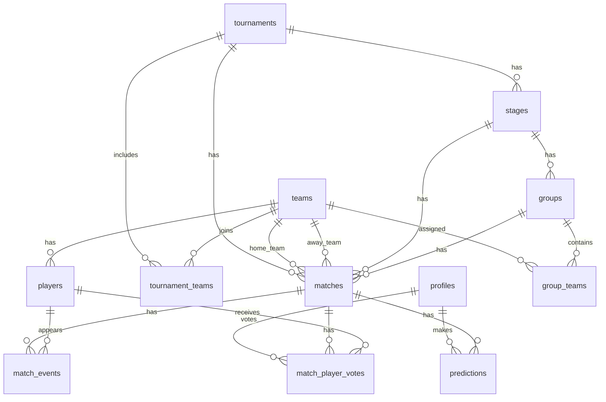

# Modelo de datos - Torneo Trives

Este documento define la primera version del modelo de datos para la web del torneo de futbol sala. La idea es mantenerlo sencillo, gratuito y facil de evolucionar cuando sepamos el numero final de equipos y el formato exacto.

## Objetivos

- Publicar informacion del torneo: equipos, jugadores, calendario, resultados, clasificaciones y estadisticas.
- Gestionar el torneo desde una zona privada de administracion.
- Registrar eventos de partido para generar estadisticas.
- Permitir votaciones al jugador del partido.
- Permitir porras de usuarios registrados.

## Entidades principales

### Usuarios

Tabla: `profiles`

Representa a los usuarios de la web. La autenticacion la gestionara Supabase Auth y esta tabla guardara los datos propios de la aplicacion.

Campos:

- `id`: UUID, mismo id que el usuario de Supabase Auth.
- `display_name`: nombre visible del usuario.
- `role`: rol del usuario. Valores: `admin`, `user`.
- `created_at`: fecha de creacion.

Notas:

- Solo los usuarios con rol `admin` podran acceder al panel de administracion.
- Los usuarios normales podran votar y participar en la porra.

### Equipos

Tabla: `teams`

Campos:

- `id`: UUID.
- `name`: nombre del equipo.
- `created_at`: fecha de creacion.
- `updated_at`: fecha de ultima modificacion.

Notas:

- De momento no guardamos escudo, colores ni entrenador.
- Si mas adelante queremos escudo, se puede anadir un campo `logo_url`.

### Jugadores

Tabla: `players`

Campos:

- `id`: UUID.
- `team_id`: equipo al que pertenece.
- `first_name`: nombre.
- `last_name`: apellidos.
- `created_at`: fecha de creacion.
- `updated_at`: fecha de ultima modificacion.

Relaciones:

- Un equipo tiene muchos jugadores.
- Un jugador pertenece a un equipo.

## Estructura del torneo

Para dejar el torneo generico, separaremos fases, grupos y partidos. Asi podremos crear los grupos desde la web cuando sepamos cuantos equipos hay.

### Torneos

Tabla: `tournaments`

Campos:

- `id`: UUID.
- `name`: nombre del torneo.
- `slug`: identificador corto para URLs.
- `status`: estado. Valores: `draft`, `active`, `finished`.
- `created_at`: fecha de creacion.
- `updated_at`: fecha de ultima modificacion.

Notas:

- Aunque ahora solo haya un torneo, crear esta tabla nos permite reutilizar la web en proximas ediciones.

### Fases

Tabla: `stages`

Campos:

- `id`: UUID.
- `tournament_id`: torneo al que pertenece.
- `name`: nombre visible. Ejemplo: Fase de grupos, Cuartos de final, Semifinal, Final.
- `type`: tipo de fase. Valores: `groups`, `knockout`.
- `order_index`: orden de visualizacion.
- `created_at`: fecha de creacion.

Notas:

- La fase de grupos tendra `type = groups`.
- Cuartos, semifinal y final tendran `type = knockout`.

### Grupos

Tabla: `groups`

Campos:

- `id`: UUID.
- `stage_id`: fase a la que pertenece.
- `name`: nombre del grupo. Ejemplo: Grupo A, Grupo B.
- `order_index`: orden de visualizacion.

Notas:

- Solo se usara normalmente en la fase de grupos.
- Permite crear tantos grupos como hagan falta desde administracion.

### Equipos inscritos en torneo

Tabla: `tournament_teams`

Campos:

- `id`: UUID.
- `tournament_id`: torneo.
- `team_id`: equipo.
- `created_at`: fecha de inscripcion.

Notas:

- Evita mezclar equipos de distintas ediciones si repetimos el torneo en el futuro.

### Equipos asignados a grupos

Tabla: `group_teams`

Campos:

- `id`: UUID.
- `group_id`: grupo.
- `team_id`: equipo.

Notas:

- Permite configurar desde la web cuantos equipos hay en cada grupo.
- La clasificacion de grupos se calculara a partir de los partidos finalizados.

## Partidos

### Partidos

Tabla: `matches`

Campos:

- `id`: UUID.
- `tournament_id`: torneo.
- `stage_id`: fase.
- `group_id`: grupo, opcional.
- `home_team_id`: equipo local, opcional al crear eliminatorias pendientes.
- `away_team_id`: equipo visitante, opcional al crear eliminatorias pendientes.
- `scheduled_at`: fecha y hora del partido, opcional.
- `home_score`: goles del equipo local.
- `away_score`: goles del equipo visitante.
- `status`: estado. Valores: `scheduled`, `in_progress`, `finished`, `cancelled`.
- `round_label`: texto libre para eliminatorias. Ejemplo: Cuarto 1, Semifinal 2.
- `created_at`: fecha de creacion.
- `updated_at`: fecha de ultima modificacion.

Notas:

- En fase de grupos, `group_id` estara informado.
- En eliminatorias, `group_id` sera nulo y usaremos `round_label` si hace falta.
- `home_team_id` y `away_team_id` pueden ser nulos al principio para crear cruces antes de saber los clasificados.

### Eventos de partido

Tabla: `match_events`

Campos:

- `id`: UUID.
- `match_id`: partido.
- `team_id`: equipo relacionado con el evento.
- `player_id`: jugador relacionado con el evento, opcional.
- `event_type`: tipo. Valores: `goal`, `yellow_card`, `red_card`, `own_goal`.
- `minute`: minuto del partido.
- `created_at`: fecha de creacion.

Notas:

- Los goles se usaran para calcular maximos goleadores.
- Las tarjetas se podran mostrar como estadisticas individuales o de equipo.
- Un evento puede no tener jugador si en algun caso no se conoce el autor.

## Votacion jugador del partido

### Votos

Tabla: `match_player_votes`

Campos:

- `id`: UUID.
- `match_id`: partido.
- `user_id`: usuario que vota.
- `player_id`: jugador votado.
- `created_at`: fecha del voto.

Reglas:

- Un usuario solo puede votar una vez por partido.
- Solo se puede votar a jugadores que pertenezcan a uno de los equipos del partido.
- La votacion se podra cerrar automaticamente cuando el partido pase a `finished`, o dejar abierta hasta que el admin la cierre. Esta decision queda pendiente.

Restricciones recomendadas:

- Unico: `match_id + user_id`.

## Porra

### Pronosticos

Tabla: `predictions`

Campos:

- `id`: UUID.
- `match_id`: partido.
- `user_id`: usuario.
- `home_score`: goles pronosticados para el equipo local.
- `away_score`: goles pronosticados para el equipo visitante.
- `points`: puntos obtenidos, inicialmente 0.
- `locked_at`: fecha en la que queda bloqueado el pronostico, opcional.
- `created_at`: fecha de creacion.
- `updated_at`: fecha de ultima modificacion.

Reglas:

- Un usuario solo puede hacer una porra por partido.
- El usuario puede editar su pronostico hasta que el partido empiece o hasta una fecha limite definida.
- Cuando el partido se cierre como `finished`, se calculan los puntos.

Sistema de puntos:

- 5 puntos por acertar el ganador.
- 5 puntos por acertar la diferencia de goles.
- 5 puntos por acertar el resultado exacto.

Ejemplo:

- Resultado real: Equipo A 4 - 2 Equipo B.
- Pronostico 3 - 1: acierta ganador y diferencia, 10 puntos.
- Pronostico 2 - 0: acierta ganador y diferencia, 10 puntos.
- Pronostico 4 - 2: acierta ganador, diferencia y resultado exacto, 15 puntos.
- Pronostico 4 - 3: acierta ganador, 5 puntos.

Restricciones recomendadas:

- Unico: `match_id + user_id`.

## Clasificaciones y estadisticas

### Clasificacion de grupos

No hace falta guardar una tabla de clasificacion al principio. Se puede calcular a partir de los partidos finalizados.

Campos calculados:

- Partidos jugados.
- Victorias.
- Empates.
- Derrotas.
- Goles a favor.
- Goles en contra.
- Diferencia de goles.
- Puntos.

Regla inicial de puntos:

- Victoria: 3 puntos.
- Empate: 1 punto.
- Derrota: 0 puntos.

Desempates pendientes de decidir:

- Diferencia de goles.
- Goles a favor.
- Resultado directo.
- Menos tarjetas.

### Estadisticas de jugadores

Se calcularan desde `match_events`.

Ejemplos:

- Maximos goleadores.
- Tarjetas amarillas.
- Tarjetas rojas.
- Goles por equipo.

### Estadisticas de porra

Se calcularan desde `predictions`.

Ejemplos:

- Ranking de usuarios por puntos.
- Aciertos exactos.
- Puntos por jornada o fase.

## Administracion

El usuario admin tendra acceso a una seccion privada para gestionar:

- Torneos.
- Equipos.
- Jugadores.
- Fases.
- Grupos.
- Asignacion de equipos a grupos.
- Partidos.
- Resultados.
- Eventos de partido.
- Revision de votos.
- Revision y recalculo de porras.

## Modelo resumido de relaciones

## Decisiones pendientes

- Numero final de equipos.
- Numero de grupos y equipos por grupo.
- Criterios de desempate en fase de grupos.
- Si la votacion al jugador del partido se cierra al finalizar el partido o manualmente.
- Si la porra se bloquea al empezar el partido o X minutos antes.
- Si habra terceros y cuarto puesto.
- Si habra penaltis en eliminatorias y como se registraran.

## Siguiente paso recomendado

Crear el esquema SQL inicial de Supabase con estas tablas, claves foraneas, restricciones unicas y politicas basicas de seguridad.
